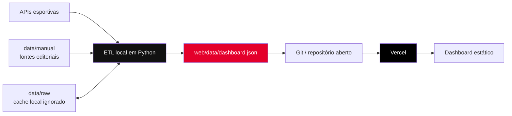

<div align="center">

# Dash Corinthians

**Um painel aberto, independente e orientado a dados sobre a campanha do Corinthians.**


</div>

O Dash Corinthians transforma resultados, tabelas, súmulas e dados editoriais em uma visão única da temporada: desempenho, probabilidades, elenco, técnicos, mercado, finanças e riscos de transfer ban.

O projeto foi desenhado com uma separação simples e intencional:

- o **ETL roda somente no computador do mantenedor**, onde ficam chaves e caches;
- a **Vercel publica apenas o dashboard estático** e o `dashboard.json` já processado;
- nenhuma chave de API é enviada para a hospedagem ou para o navegador.

> Projeto independente e não oficial. Não possui vínculo com o Sport Club Corinthians Paulista, ESPN, CBF, CONMEBOL, FIFA ou demais fontes citadas.

## O que existe no painel

- Campanha por temporada, competição e mando de campo.
- Aproveitamento, pontos por jogo, saldo e forma recente.
- Evolução da pontuação e comparação com uma meta configurável.
- Jogos, placares, estádios, público e estatísticas por partida.
- Desempenho por competição, temporada e clássicos.
- Gols por faixa de minuto, artilheiros e assistentes.
- Calendário, descanso, adversários e sequências.
- Simulação Monte Carlo do Brasileirão com 10.000 cenários.
- Comparação dos cinco últimos técnicos.
- Diagnóstico explicável do elenco por setor.
- Radar de mercado em seis ligas, com índice técnico e custo-benefício quando há valor documentado.
- Receitas oficiais, estimativa parcial do ano corrente e evolução do passivo.
- Transfer bans, obrigações monitoradas, fontes e data-base.
- Auditoria de cobertura e qualidade dos dados publicados.
- Temas claro e escuro e layout responsivo.

## Arquitetura



O navegador não consulta as APIs esportivas. Ele baixa um único snapshot gerado pelo ETL, o que torna o site rápido, barato de hospedar e previsível.

## Tecnologias

| Camada | Tecnologia |
| --- | --- |
| ETL e servidor local | Python 3.12+, pandas, NumPy e requests |
| Frontend | HTML, CSS e JavaScript puro |
| Gráficos | Apache ECharts 5.5.1 via CDN |
| Persistência local | JSON e cache HTTP em disco |
| Hospedagem | Vercel, como site totalmente estático |
| Armazenamento remoto legado | Upstash Redis, opcional |

Não há framework frontend, bundler ou etapa de compilação no deploy.

## Fontes de dados

| Fonte | Uso | Chave |
| --- | --- | --- |
| ESPN | Jogos, tabelas, súmulas, estatísticas e elencos | Não |
| API-Football | Complemento de partidas e elenco | Opcional |
| football-data.org | Fallback do Brasileirão | Opcional |
| TheSportsDB | Fotos de atletas | Não |
| `data/manual/` | Técnicos, balanços, transfer bans e valores de mercado | Editorial |

Integrações externas passam por cache, TTL, tentativas controladas e limites de requisição. Quando uma fonte falha, o ETL pode utilizar cache vencido e registra o ocorrido nos avisos do dashboard.

Dados financeiros, jurídicos e valores de mercado mantidos manualmente devem sempre incluir um link para a origem. Estimativas e heurísticas são identificadas como tal na interface.

## Começando

### Requisitos

- Python 3.12 ou superior;
- PowerShell para o script de atualização incluído;
- Node.js apenas para a verificação opcional de sintaxe do frontend;
- conexão com a internet para atualizar fontes externas.

### Instalação no Windows

```powershell
git clone URL_DO_SEU_REPOSITORIO
cd "Dash Corinthians"

python -m venv .venv
.\.venv\Scripts\Activate.ps1
python -m pip install -r requirements.txt

Copy-Item .env.example .env
```

Todas as chaves são opcionais. Preencha somente as integrações que deseja utilizar:

```dotenv
API_FOOTBALL_KEY=
FOOTBALL_DATA_KEY=
SEASONS=2024,2025,2026
TARGET_RATE=0.60
```

O `.env` é ignorado pelo Git.

## Atualizando os dados no seu PC

O caminho recomendado é:

```powershell
.\scripts\update_dashboard.ps1
```

O script:

1. executa `python -m etl.build`;
2. atualiza caches e `web/data/dashboard.json`;
3. executa `python -m etl.validate`;
4. informa o artefato pronto para revisão e commit.

Também é possível executar manualmente:

```powershell
python -m etl.build
python -m etl.validate
```

O ETL pode consumir cotas das APIs configuradas. Não execute várias instâncias simultâneas.

## Visualizando localmente

```powershell
python server.py
```

Acesse [http://127.0.0.1:8000](http://127.0.0.1:8000).

O servidor não roda o ETL automaticamente. Você controla as atualizações pelo script, pelo comando direto ou pelo botão local do dashboard. Para ativar uma tentativa automática diária explicitamente:

```powershell
python server.py --auto
```

Os endpoints `/api/status` e `/api/refresh` existem apenas no servidor local. Na Vercel, o frontend detecta a ausência deles e oculta o botão de atualização.

## Publicando na Vercel

O arquivo [`vercel.json`](vercel.json) já configura:

- preset `Other` (`framework: null`);
- nenhuma etapa de instalação ou build;
- diretório público `web/`;
- revalidação do `dashboard.json`;
- cabeçalhos básicos de segurança.

### Pela integração com Git

1. Crie um repositório no GitHub, GitLab ou Bitbucket.
2. Faça commit do código e do `web/data/dashboard.json` gerado.
3. Na Vercel, escolha **Add New → Project** e importe o repositório.
4. Mantenha o diretório raiz do projeto. As demais opções são lidas do `vercel.json`.
5. Publique.

A Vercel não precisa das chaves do ETL. Não cadastre `API_FOOTBALL_KEY`, `FOOTBALL_DATA_KEY` ou credenciais Upstash no projeto Vercel para este fluxo.

### Ciclo de atualização

```text
Atualizar localmente → validar → revisar dashboard.json → commit → push → Vercel publica
```

Exemplo:

```powershell
.\scripts\update_dashboard.ps1
git add web/data/dashboard.json data/manual
git commit -m "data: atualiza snapshot do dashboard"
git push
```

Esse processo mantém as chamadas externas, decisões editoriais e chaves sob seu controle.

## Validação

```powershell
# contrato, totais, duplicidades e números inválidos do snapshot
python -m etl.validate

# sintaxe Python
python -m compileall -q server.py etl

# sintaxe JavaScript, se Node.js estiver instalado
node --check web/app.js
```

O validador confirma temporadas, partidas, visões, recortes de elenco, chaves obrigatórias, totais de campanha e unicidade por fonte/evento sem acessar a internet.

O workflow [`.github/workflows/validate.yml`](.github/workflows/validate.yml) executa essas verificações automaticamente em pushes e pull requests. A CI nunca executa o ETL nem consome APIs externas.

## Estrutura do projeto

```text
.
├── data/
│   ├── manual/             # dados editoriais com fontes
│   └── raw/                # cache local, ignorado pelo Git
├── etl/
│   ├── sources/            # adaptadores das APIs
│   ├── build.py            # pipeline principal
│   ├── metrics.py          # KPIs e agregações
│   ├── simulate.py         # modelo Monte Carlo
│   ├── scouting.py         # radar de mercado
│   ├── squad_analysis.py   # diagnóstico do elenco
│   ├── finance.py          # receitas e transfer bans
│   └── validate.py         # validação offline do snapshot
├── scripts/
│   └── update_dashboard.ps1
├── web/
│   ├── data/dashboard.json # snapshot publicado
│   ├── index.html
│   ├── styles.css
│   └── app.js
├── server.py               # preview e atualização local
└── vercel.json             # deploy estático
```

## O que não deve ir para o Git

- `.env` e qualquer segredo;
- `.venv/`;
- `data/raw/`;
- caches de detalhes e fotos;
- arquivos `__pycache__` e `.pyc`;
- `.vercel/`, que contém o vínculo local com uma conta/projeto.

O snapshot `web/data/dashboard.json` **deve** ser versionado, pois é o banco de dados estático consumido pela Vercel.

## Limitações

- APIs públicas podem mudar ou ficar indisponíveis.
- Valores de mercado não representam necessariamente preço de compra ou salário.
- O radar de mercado não substitui observação em vídeo, análise médica ou negociação.
- A simulação é probabilística e não garante resultados.
- A estimativa financeira corrente é parcial e mostra suas lacunas na interface.
- O indicador de transfer ban é informativo e não constitui parecer jurídico.
- Parte das fontes do frontend, incluindo ECharts e fontes tipográficas, depende de CDN.

## Contribuindo

Contribuições são bem-vindas. Consulte [`CONTRIBUTING.md`](CONTRIBUTING.md) e leia [`AGENTS.md`](AGENTS.md) e [`context.md`](context.md) antes de começar.

Ao contribuir com dados editoriais, inclua fonte direta e data-base. Ao alterar o contrato JSON, atualize produtor, consumidor, validador e documentação no mesmo pull request.

## Licença

O código está disponível sob a [Licença MIT](LICENSE).

Marcas, escudos, nomes, fotografias e dados provenientes de terceiros pertencem aos respectivos titulares e podem estar sujeitos a termos próprios. A licença MIT cobre o código deste repositório, não concede direitos sobre ativos ou dados de terceiros.

---

<div align="center">

Feito com dados, transparência e respeito pelo Corinthians. 🖤🤍

</div>
